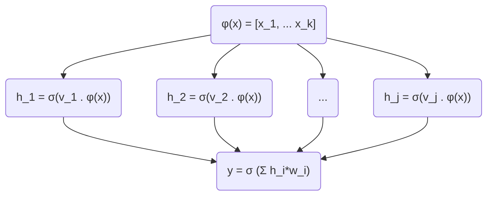
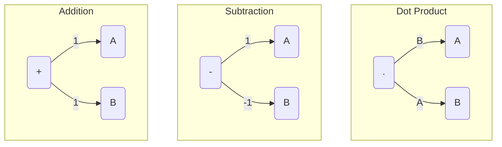
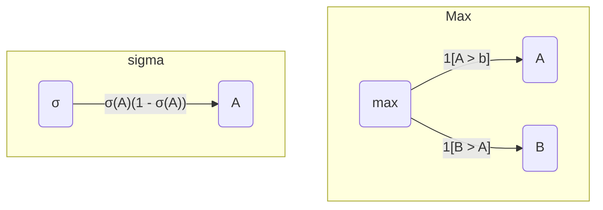
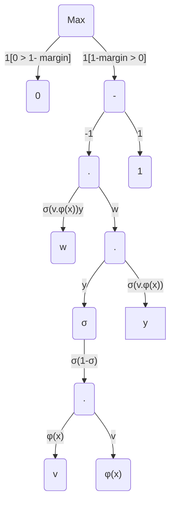

Sometimes, we don't have enough domain knowledge to figure out what features are good to use, or the ones we figure out does not work as expected.

Neural Networks helps ease the importance of [feature extraction](2.features.md) by allowing for cruder features, but more detailed learning algorithms.

In some sense, Neural Networks enable automatic feature identification for a particular task instead of specifying them all by hand.

As an introduction, let's take a look at a simple problem.

## Motivating Example

Suppose you are playing a game of [Tower Blocks](https://www.novelgames.com/en/towerblocks/) and you are trying to build a bot to play it like a human. (read, bad)

To do so, you need to line the right edge up with the right edge of the existing block. Let's denote this as $x_1$ and $x_2$ respectively.

$x_i$ is 0 when the edges are at the left most of the screen.


The classifier will then tell us whether it's safe or not safe to drop the block $+1, -1$ respectively.

Attempting to solve this problem without a neural net, we can split the problem into two sub-problems.

1. The incoming edge is too far left from the existing edge. (We miraculously know this limit at more than 10 pixels away)
2. The incoming edge is too far right from the existing edge. (same as above)

If either is true, we return not safe ($-1$).

Mathematically:

$$h_1 = 1[x_1 - x_2 \leq 10]$$ (1)
$$h_2 = 1[x_1 - x_2 \geq 10]$$ (2)
$$y = -sign(h_1 + h_2)$$


So if we had an input $\begin{bmatrix}x_1: 10 \\\\ x_2: 25 \end{bmatrix}$:

$$\begin{aligned}h_1 &= 1\\\\h_2 &= 0\\\\y &= - sign(1 + 0) \\\\&= -1\end{aligned}$$

Thus, we would conclude that it is not safe to drop the block now.

Notice that the equations (1) and (2) both look a lot like the [binary linear classifier](reflex.md/#binary-linear-classifier) equation.

In fact, it is not wrong to think that a neural network is basically composed of linear predictors like the binary classifier combined together.

Generalizing for equations (1) and (2), we would get something like this:
$$\begin{aligned}\phi(x) &= [1, x_1, x_2] \\\\h_1 &= 1[v_1 \cdot \phi (x) \leq 0], \space v_1 = [-10, 1, -1]\\\\h_2 &= 1[v_2 \cdot \phi (x) \leq 0], \space v_2 = [-10, -1, 1]\end{aligned}$$
The $1$ in the feature vector, $\phi(x)$, is just to allow us to modulate the $0$ on the right hand side. (If you're still confused, expand the terms and $v_1, \phi(x)$ and rearrange it. You'll notice that it becomes the same as our original $h_1$ equation above.)

The final prediction will then be:
$$y = sign(w_1 h_1 + w_2 h_2), \space \bold{w} = [-1, -1]$$

## Training Neural Networks

A problem appears when we try to train the weights of $v_1,v_2,w_1,w_2$ - the gradients are always - because of the hard threshold function that we used.

Therefore, we can instead use a logistic function that looks like the step function, has non-zero gradients everywhere. In particular, the sigmoid function will be used, $\sigma(z) = (1 + e^{-z})^{-1}$.

$h_1$ will now look like $h_1 = \sigma(v_1 \cdot \phi (x))$, and $y = \sigma(w_1 h_1 + w_2 h_2)$

These functions are known as [activation functions](#short-note-on-activation-functions)

## Neural Networks in more detail

The (one-layer) neural network is mapping the incoming feature nodes onto $h \in \real^d$ nodes.

For $k$ number of hidden units, the weight vector $v_j$ is used to determine the value at hidden node $h_j$, where $j = 1 \cdots k$.

This is done through the function $h_j = \sigma(v_j \cdot \phi (x))$

The values of the activation vectors, $h = [h_1 \cdots h_k]$, are now combined with another weight vector $\bold{w}$ to produce the final output.

In all, here's the process for a 2 layer (1 hidden layer) neural network:



## Short note on activation functions

The main property of an activation function is its non-linearity.

The logistic function, $\large \sigma(z) = (1 + e^{-z})^{-1}$ is the most common activation function. It squishes all real numbers into a range between 0 and 1.

The days however, the rectifier function, commonly known as the Rectified Linear Unit (ReLU) has become more popular. $ReLU(z) = \max (z , 0)$.

This function solves two problems that the sigmoid logistic function above has. It solves the vanishing gradient problem that $\sigma(z)$ has for larger values, making it easier to optimize. it also uses $\max$ instead of an exponent, making it computationally easier.

One way to think about neural networks is that the intermediate layers can be thought of as learning the features of a linear classifier, so long as the learning follows the function $\sigma(v_j \cdot \phi(x))$.

## Gradients

Above, we've basically spelt out our optimization problem. Now we turn to look at how we might go about optimizing the above problem.

You might have guess it, we'll use [Stochastic Gradient Descent](reflex.md/#stochastic-gradient-descent).

The goal as always, is to minimize $TrainLoss$. We take $\nabla_{\bold{V}, \bold{w}} TrainLoss(\bold{V}, \bold{w})$ and attempt to find the minimum.

While it's definitely possible to solve by hand, solving for neural networks that are layers deep will eventually become too tedious.

Here, we'll introduce a way to calculate the gradient through computational graphs.

### Computational Graphs

The advantage is the doing away with long error-prone computed equations.

It also reveals the computation structure that modern machine learning frameworks are built on.

To start, think of functions as a toaster. bread (input) in, toast (output) out.

Partial derivatives is then the measure of sensitivity of a function to that particular term. (how much the factor affects cooking speed of toast).

The diagram below show the 5 most common computation and their partial derivatives with respect to the signs.





The weights for each edge represents the partial derivative, so for the max graph above:

$$\begin{matrix} \frac{\delta top}{\delta bottom} &= \large \frac{\delta max}{\delta A} \\\\ &= 1[A > B] \end{matrix}$$

We can use this concept to compose the derivatives with respect to a particular element simply by multiplying the weights from the edge starting from the element in question to the root of the tree (output function).

In essence, we are doing what is known as Backpropagation.

Confused? Let's take a look at an example.

### Backpropagation

#### Example: Neural Network

Let's apply the concept of backpropagation to the hinge loss for our neural network:

$$Loss(x, y, \bold{V}, \bold{w}) = \max (1 - \bold{w} \cdot \sigma(\bold{v \cdot \phi(x)})y, 0)$$

I suggest attempting the above on paper and then comparing your answers to the working below.

The first step is do the forward pass. All that's being done here is to split the equation into its constituent parts.

##### Forward Pass

$$\begin{aligned}Loss &= \max(u, z) \\\\z &= 0 \\\\u &= u_1 - u_2 \\\\u_1 &= 1 \\\\u_2 &= t \\\\t &= t_1 \cdot t_2 \\\\t_1 &= \bold{w}\\\\t_2 &= s_1 s_2 \\\\s_1 &= \sigma(k) \\\\s_2 &= y \\\\k &= \bold{v} \cdot \phi (x) \\\\\end{aligned}$$

Having broken down each term, we can figure out the differential of the $Loss$ with respect to each of the terms in the backward pass

##### Backward Pass

$$\begin{aligned}\frac{\delta Loss}{\delta z} &= 1[z > u] \space\space\space\space\frac{\delta Loss}{\delta u} = 1[u > z] \\\\\frac{\delta Loss}{\delta u_1} &= \frac{\delta Loss}{\delta u} \frac{\delta u}{\delta u_1}, \frac{\delta u}{\delta u_1} = 1 \space \space\space\space\frac{\delta Loss}{\delta u_2} = \frac{\delta Loss}{\delta u} \frac{\delta u}{\delta u_2}, \frac{\delta u}{\delta u_2} = -1 \\\\\frac{\delta Loss}{\delta t} &= \frac{\delta Loss}{\delta u_2}\frac{\delta u_2}{\delta t}, \frac{\delta u_2}{\delta t} = 1 \\\\\frac{\delta Loss}{\delta t_1} &= \frac{\delta Loss}{\delta t}\frac{\delta t}{\delta t_1}, \frac{\delta t}{\delta t_1} = t_2 \space\space\space\space\frac{\delta Loss}{\delta t_2} = \frac{\delta Loss}{\delta t}\frac{\delta t}{\delta t_2}, \frac{\delta t}{\delta t_2} = t_1 \\\\\frac{\delta Loss}{\delta \bold{w}} &= \frac{\delta Loss}{\delta t_1}\frac{\delta t_1}{\delta \bold{w}}, \frac{\delta t_1}{\delta \bold{w}} = 1 \\\\\frac{\delta Loss}{\delta s_1} &= \frac{\delta Loss}{\delta t_2}\frac{\delta t_2}{\delta s_1}, \frac{\delta t_2}{\delta s_1} = s_2 \space\space\space\space\frac{\delta Loss}{\delta s_2} = \frac{\delta Loss}{\delta t_2}\frac{\delta t_2}{\delta s_2}, \frac{\delta t_2}{\delta s_2} = s_1 \\\\\frac{\delta Loss}{\delta k} &= \frac{\delta Loss}{\delta s_1}\frac{\delta s_1}{\delta k}, \frac{\delta s_1}{\delta k} = \sigma(1 - \sigma(k))\\\\\frac{\delta Loss}{\delta y} &= \frac{\delta Loss}{\delta s_2}\frac{\delta s_2}{\delta y}, \frac{\delta s_2}{\delta y} = 1\\\\\frac{\delta Loss}{\delta v} &= \frac{\delta Loss}{\delta k}\frac{\delta k}{\delta v}, \frac{\delta k}{\delta v} = \phi(x) \space\space\space\space\frac{\delta Loss}{\delta x} = \frac{\delta Loss}{\delta k}\frac{\delta k}{\delta x}, \frac{\delta k}{\delta x} = v \end{aligned}$$

Graphically, things will look something like:



Therefore $\nabla_{\bold{V}} Loss = -1[1 - \bold{w} \cdot \sigma(\bold{V}\cdot \phi(x))y > 0]\space \bold{w} \space y \space \sigma (\bold{V} \cdot \phi(x)) \space [1 - \sigma(\bold{V} \cdot \phi(x))] \space \phi(x)$

#### Example 2: random

Let us suppose we have this equation:

$$f(x,y)=x+σ(y)σ(x)+(x+y)2$$

Approaching it in more of a code fashion.

##### Forward pass

```python
x = 3 # example values
y = -4

# forward pass
sigy = 1.0 / (1 + math.exp(-y)) # sigmoid in numerator   #(1)
num = x + sigy # numerator                               #(2)
sigx = 1.0 / (1 + math.exp(-x)) # sigmoid in denominator #(3)
xpy = x + y                                              #(4)
xpysqr = xpy**2                                          #(5)
den = sigx + xpysqr # denominator                        #(6)
invden = 1.0 / den                                       #(7)
f = num * invden # done!                                 #(8)
```

##### backward pass

```python
# backprop f = num * invden
dnum = invden # gradient on numerator                             #(8)
dinvden = num                                                     #(8)
# backprop invden = 1.0 / den
dden = (-1.0 / (den**2)) * dinvden                                #(7)
# backprop den = sigx + xpysqr
dsigx = (1) * dden                                                #(6)
dxpysqr = (1) * dden                                              #(6)
# backprop xpysqr = xpy**2
dxpy = (2 * xpy) * dxpysqr                                        #(5)
# backprop xpy = x + y
dx = (1) * dxpy                                                   #(4)
dy = (1) * dxpy                                                   #(4)
# backprop sigx = 1.0 / (1 + math.exp(-x))
dx += ((1 - sigx) * sigx) * dsigx # Notice += !! See notes below  #(3)
# backprop num = x + sigy
dx += (1) * dnum                                                  #(2)
dsigy = (1) * dnum                                                #(2)
# backprop sigy = 1.0 / (1 + math.exp(-y))
dy += ((1 - sigy) * sigy) * dsigy                                 #(1)
# done! phew
```

One note is that gradients add up at forks.

When the forward expression involves the variables x,y multiple times, backpropagation will use += instead of = to accumulate the gradient on these variables (otherwise we would overwrite it).

This follows the multi-variable chain rule in Calculus, which states that if a variable branches out to different parts of the circuit, then the gradients that flow back to it will add.

## Closing thoughts

In closing, neural networks are something like an automatic feature learner. Used correctly, they can make a normal Linear Predictor even more correctly. used incorrectly however, and it becomes a case whereby long training times are spent for little improvements.

Each hidden node have their scores pass through an activation function, be it $\sigma$ or ReLU, or some other function.

Each of the hidden node values, $h = [h_1, h_2, \cdots, h_k]$ is then fed into the next set of hidden nodes, getting scored and modulated by an activation function.

Finally, the penultimate layer is scored, and passed to an output node. A regressor will use the value as is, while the classifier will once more, pass the score through an activation function.

To train the network, we attempt to minimize the $Loss$ of the output through [Stochastic Gradient Descent](1.reflex.md/#stochastic-gradient-descent)

To calculate the gradient for training, we use backpropagation which consist of two steps.

First, we break the $Loss$ function into smaller terms. This is known as the forward pass.

Secondly, we find the differential of those terms with respect to the $Loss$ function. Multiplying the partial derivatives together will allow us to get the final differential we want.

Finally, with the derivatives, we are able to use Stochastic gradient descent and minimize our training loss.
