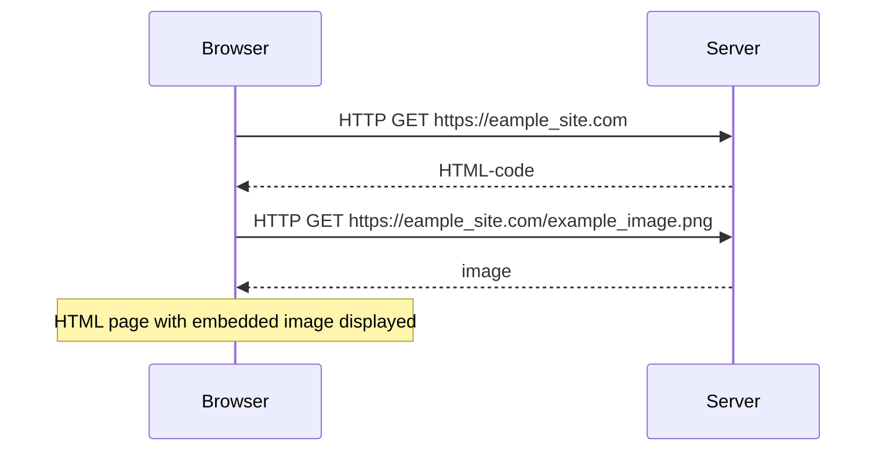

## HTTP GET

In general, when a web page is loading, the browser will do a `GET` request to a server to retrieve the information to display.

Having made a request, the server can return a couple of things.

Under the `Network` tab in developers console `ctrl` + `shift` + `i`, we can see details about incoming requests.

`General` under the `Network` > `Headers` tab tells us about the status of the request.

### Status codes

- **1xx informational response**: the request was received, continuing process
- **2xx successful**: the request was successfully received, understood, and accepted
- **3xx redirection**: further action needs to be taken in order to complete the request
- **4xx client error**: the request contains bad syntax or cannot be fulfilled
- **5xx server error**: the server failed to fulfil an apparently valid request

`Response headers` tell us:

- `content-length`: The size of the response in bytes
- `Date`: The exact Time of the response.
- `Content-Type`: The format of the response. In this case, a `text/html` or `image/png`

`Network` > `Response` tab shows the response data, usually a regular HTML-page.

if an `img` tag exist, the browser will do a second HTTP-request to fetch the image from the server.

```HTML
<!DOCTYPE html>
<html>
    <head>
    </head>
    <body>
    <div class='container'>
        
    </div>
    </body>
</html>
```

The calls will look something like:



Diagram is read from top left to bottom left, following the arrows as you go.

## Document Object Model or DOM

We can think of HTML-pages as implicit tree structures.

The same treelike structure can be seen on the console tab `Elements` (or `inspector` if you're using Firefox).

Document Object Model (DOM) is an Application Programming Interface (API), which enables programmatic modification of the element trees.

The following code creates a new node to the variable `ul`, and adds some child nodes to it.

The `ul` is then appended to the webpage as the child of some element as retrieved by its `id`.

```js
var ul = document.createElement('ul')

data.forEach(function(note) {
  var li = document.createElement('li')

  ul.appendChild(li)
  li.appendChild(document.createTextNode(note.content))
})

document.getElementById('SOME_ID').appendChild(ul)
```

## Manipulating the document-object from console

Here is an example of retrieving the first unordered list element from the DOM and adding a list object to it:

```js
list = document.getElementsByTagName('ul')[0]

newElement = document.createElement('li')
newElement.textContent = 'Page manipulation from console is easy'

list.appendChild(newElement)
```

Even though the page updates on your browser, the changes are not permanent. If the page is reloaded, the new note will disappear, because the changes were not pushed to the server.

Data on the webpage is built based of the code it fetches from the server, not from local changes.
